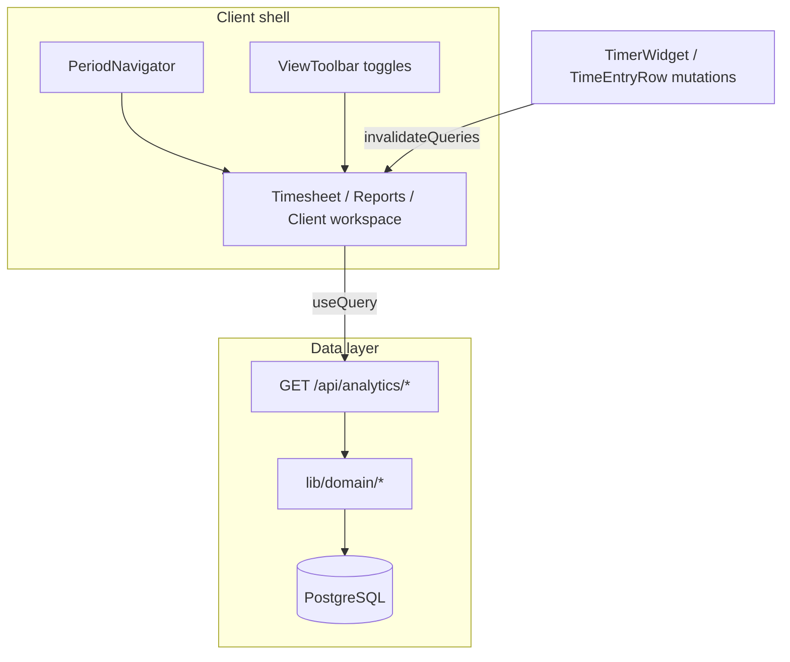

# Analytics UX: Timesheet, Reports, Client

Redesign plan for timesheet, reports, and client detail — wide layout, month/period navigation, toggleable views, live data via React Query.

## User decisions

- **Client grid:** Week / Month toggle on the same grid (both modes).
- **Delivery:** everything in one pass.

## Current state (problems)

| Area | Today | Limit |
|------|------|--------|
| Layout | [`app/(app)/layout.tsx`](../../app/(app)/layout.tsx) forces `max-w-3xl` everywhere | Charts and tables too narrow |
| Timesheet | **Week** navigation only ([`timesheet-filters.tsx`](../../components/features/timer/timesheet-filters.tsx)); `window.location.href` on selects | No convenient month view; full reload |
| Reports | 3 fixed presets (`week` / `last-week` / `month`) in [`report-range.ts`](../../lib/utils/report-range.ts) | Cannot pick March 2024, a quarter, etc. |
| Client | Month/last/all presets + custom dates ([`client-billing-filters.tsx`](../../components/features/timer/client-billing-filters.tsx)); weekly grid separate from billing period | Fragmented overview; long scroll |

The data domain is ready: [`lib/domain/analytics.ts`](../../lib/domain/analytics.ts), [`getClientAggregates`](../../lib/domain/time-entries.ts), [`listTimeEntriesForUser`](../../lib/domain/time-entries.ts), [`getProjectAggregatesForClient`](../../lib/domain/time-entries.ts). **No new DB schema needed.**

`@tanstack/react-query` is already configured in [`app/providers.tsx`](../../app/providers.tsx) but not used for analytics — the right place for "live" updates (refetch on filter change + invalidate after start/stop/edit timer).



---

## Todo

- [ ] Create `lib/utils/analytics-period.ts`, API `/api/analytics/*`, `lib/queries/analytics.ts`, invalidate from timer
- [ ] `PeriodNavigator`, `ViewToolbar`, `AnalyticsPageShell` + layout `max-w-6xl` for timesheet/reports/client
- [ ] Refactor reports page: React Query, month navigation, tab/toggle views, taller charts
- [ ] Refactor timesheet: month/week/custom, day/summary/calendar views, filters without reload
- [ ] Refactor `client/[id]`: Overview/Grid/Tasks/Entries tabs, week+month grid, period chart
- [ ] Unit `analytics-period` + update E2E reports/timesheet + `client-analytics`

---

## 1. Shared infrastructure

### Unified period

New [`lib/utils/analytics-period.ts`](../../lib/utils/analytics-period.ts) (extends [`timesheet-week.ts`](../../lib/utils/timesheet-week.ts) and [`report-range.ts`](../../lib/utils/report-range.ts)):

- Canonical query: `period=2026-06` (any month), or `from` + `to` (custom), or preset `week | last-week | month | quarter | ytd`
- User timezone resolution (`Europe/Rome` default, as in reports today)
- Helpers `buildPeriodSearchParams`, `shiftPeriod(±1)`, `formatPeriodLabel`
- Unit tests in [`tests/unit/analytics-period.test.ts`](../../tests/unit/analytics-period.test.ts) (style of [`tests/unit/timesheet-week.test.ts`](../../tests/unit/timesheet-week.test.ts))

### Reusable components (`components/features/analytics/`)

- **`period-navigator.tsx`** — prev/next, month/year dropdown (Calendar + last 12 months list), preset chips, custom range with [`DatePicker`](../../components/ui/date-picker.tsx); `router.replace` + `startTransition` (Next 16 pattern: `useRouter` / `usePathname` / `useSearchParams`)
- **`view-toolbar.tsx`** — multi-select toggle chips (e.g. `charts`, `byClient`, `byProject`, `entries`, `tasks`) persisted in URL (`view=charts,byClient`)
- **`analytics-page-shell.tsx`** — header + toolbar sticky under topbar; full-width content area

### Wide layout (analytics pages only)

Nested layouts that override width without touching Today/Inbox:

- [`app/(app)/timesheet/layout.tsx`](../../app/(app)/timesheet/layout.tsx)
- [`app/(app)/reports/layout.tsx`](../../app/(app)/reports/layout.tsx)
- [`app/(app)/clients/[id]/layout.tsx`](../../app/(app)/clients/[id]/layout.tsx)

Content: `max-w-6xl` or `max-w-[90rem]` + consistent padding (vs global `max-w-3xl` in parent layout — child can "break out" with `max-w-none w-full` on the inner wrapper).

---

## 2. JSON API + React Query

New route handlers (auth: same pattern as [`app/api/reports/time-entries.csv/route.ts`](../../app/api/reports/time-entries.csv/route.ts) — `requireActiveOrganization()`):

| Route | Payload |
|-------|---------|
| `GET /api/analytics/workspace` | KPI, `hoursByDay`, `clientRows`, `projectRows`, `pieData` for reports |
| `GET /api/analytics/timesheet` | entries grouped by day, totals, filters `clientId` / `projectId` |
| `GET /api/analytics/clients/[id]` | client totals, `projectAggregates`, `hoursByDay`, entries summary, task counts |

Query key factory in [`lib/queries/analytics.ts`](../../lib/queries/analytics.ts).

Client hooks:

- `useWorkspaceAnalytics(period)`
- `useTimesheetAnalytics(period, filters)`
- `useClientAnalytics(clientId, period)`

**Real-time:** after timer mutations in [`timer-widget`](../../components/features/timer/timer-widget.tsx) / [`time-entry-edit-dialog`](../../components/features/timer/time-entry-edit-dialog.tsx) / quick grid → `queryClient.invalidateQueries({ queryKey: ['analytics'] })`. Optional `refetchInterval: 30_000` only when a timer `isRunning` exists (light polling).

Server pages remain thin entry points (auth + initial props) or become client-only with skeleton — preference: **server shell + client workspace** with `initialData` from first SSR fetch to avoid empty flash.

---

## 3. Reports — flexible dashboard

Refactor [`app/(app)/reports/page.tsx`](../../app/(app)/reports/page.tsx) → composition:

```
PageHeader + Export/Print (range-aware)
PeriodNavigator
ViewToolbar: [Overview] [Charts] [Clients] [Projects]  (+ metric chips)
```

**Overview (default):** 4–6 column KPI grid on desktop; hours/day sparkline; top 5 clients.

**Toggleable panels** (Clockify/Kimai inspired):

- Hours/day chart (height `h-72`–`h-96`, [`hours-by-day-chart.tsx`](../../components/features/reports/hours-by-day-chart.tsx))
- Client distribution ([`client-pie-chart.tsx`](../../components/features/reports/client-pie-chart.tsx))
- Client/project tables with sortable columns (header click → `sort=` in URL)
- Quick client/project filter in the toolbar

**Periods:** any month via navigator; keep week / last-week as presets; add quarter + YTD.

CSV export / print: update query string to use resolved `from`/`to` (not only `range=month`).

---

## 4. Timesheet — Kimai/Clockify style

Refactor [`app/(app)/timesheet/page.tsx`](../../app/(app)/timesheet/page.tsx) + replace logic in [`timesheet-filters.tsx`](../../components/features/timer/timesheet-filters.tsx) with `PeriodNavigator` + client/project filters (no `window.location.href` — `router.replace`).

**Views (URL toggle `mode=`):**

1. **Days** — current per-day list (default)
2. **Summary** — aggregated table by project/client in the period (hours, amount, entry count)
3. **Calendar** — month/week grid with totals per cell (read-only; click day → filter list)

Sticky KPI: hours, billable, entries; immediate update from React Query.

Support **full month** in addition to week (`period=YYYY-MM` or `from`/`to`).

---

## 5. Client detail — overview

Refactor [`app/(app)/clients/[id]/page.tsx`](../../app/(app)/clients/[id]/page.tsx):

### Compact header

Name + actions (timer, edit) + contact meta; below **PeriodNavigator** (replaces [`ClientBillingFilters`](../../components/features/timer/client-billing-filters.tsx) — CSV export stays).

### Main tabs ([`Tabs`](../../components/ui/tabs.tsx))

| Tab | Content |
|-----|-----------|
| **Overview** | KPI (hours, billable, internal, amount) + hours/day chart in period + project breakdown (table + bar chart) |
| **Hour grid** | [`ClientQuickEntryGrid`](../../components/features/timer/client-quick-entry-grid.tsx) with **Week / Month toggle**: week = current behavior; month = columns for days in selected month + row/column totals |
| **Tasks** | list + create (as today) |
| **Entries** | `TimeEntryRow` list + `ManualEntryForm` |

Secondary `ViewToolbar` to show/hide sections inside Overview (e.g. hide tasks for numbers only).

Month grid domain: extend [`listQuickGridDataForClient`](../../lib/domain/time-entries.ts) to accept generic `rangeStart`/`rangeEnd` (not only 7 days) — GROUP BY query unchanged, only a wider date window.

---

## 6. Domain extensions (minimal)

In [`lib/domain/time-entries.ts`](../../lib/domain/time-entries.ts) / [`lib/domain/analytics.ts`](../../lib/domain/analytics.ts):

- `getClientHoursByDay({ organizationId, clientId, from, to })` — filtered wrapper on `getHoursByDay` or dedicated query with `clientId`
- Possible `getTimesheetSummaryByProject` for timesheet summary view

Everything with explicit `organizationId` (AGENTS.md rule).

---

## 7. Tests and verification

- Unit: `analytics-period` (months, timezone edges, custom range)
- Updated E2E:
  - [`tests/e2e/reports.spec.ts`](../../tests/e2e/reports.spec.ts) — month navigation, view toggles
  - [`tests/e2e/timesheet.spec.ts`](../../tests/e2e/timesheet.spec.ts) — month + view change
  - New `tests/e2e/client-analytics.spec.ts` — overview tab + week/month grid toggle
- Manual: start/stop timer → KPI updates without reload
- CI: `pnpm lint && pnpm typecheck && pnpm test` + spot E2E reports/timesheet

---

## Implementation order

1. `analytics-period` + API routes + query hooks + timer invalidate
2. Wide layout + `PeriodNavigator` / `ViewToolbar`
3. Reports workspace (client)
4. Timesheet workspace (client)
5. Client detail tabs + week/month grid
6. Tests + align export/print URLs

## Out of scope (optional follow-up)

- Previous period comparison (% Δ)
- Saved reports / custom workspace views
- Dedicated full-screen mode
