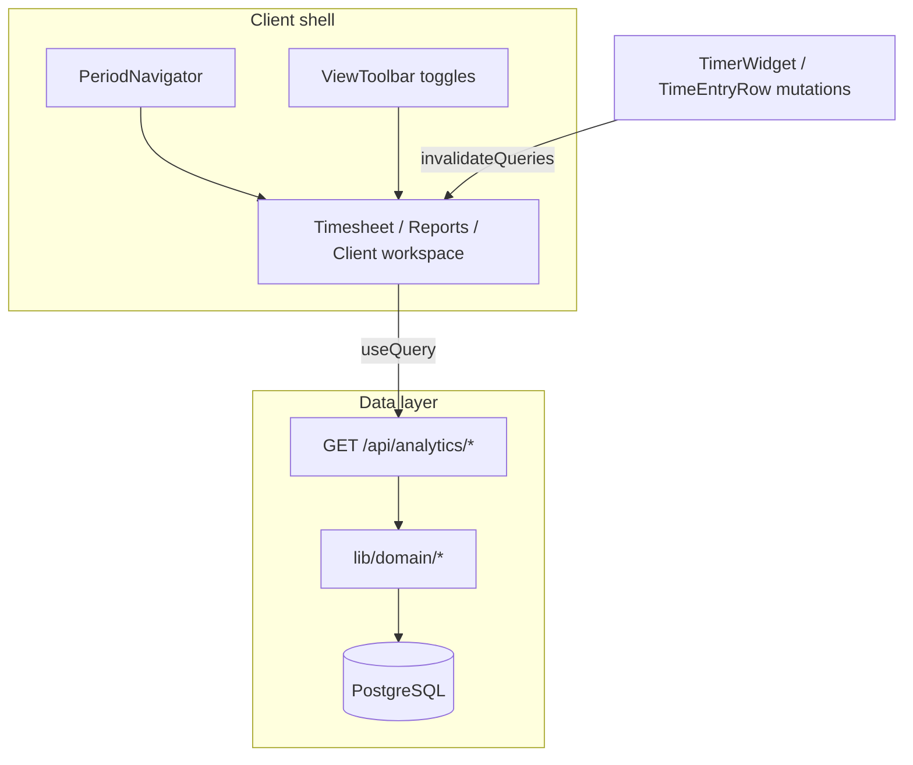

# Analytics UX: Timesheet, Reports, Cliente

Piano di redesign per timesheet, reports e dettaglio cliente — layout largo, navigazione mesi/periodi, viste toggleabili, dati live via React Query.

## Decisioni utente

- **Griglia cliente:** toggle Settimana / Mese sulla stessa griglia (entrambe le modalità).
- **Consegna:** tutto insieme in un unico intervento.

## Stato attuale (problemi)

| Area | Oggi | Limite |
|------|------|--------|
| Layout | [`app/(app)/layout.tsx`](../../app/(app)/layout.tsx) forza `max-w-3xl` su tutto | Grafici e tabelle troppo stretti |
| Timesheet | Solo navigazione **settimana** ([`timesheet-filters.tsx`](../../components/features/timer/timesheet-filters.tsx)); `window.location.href` sui select | Nessun mese comodo; reload completo |
| Reports | 3 preset fissi (`week` / `last-week` / `month`) in [`report-range.ts`](../../lib/utils/report-range.ts) | Impossibile scegliere marzo 2024, trimestre, ecc. |
| Cliente | Preset mese/scorso/tutto + date custom ([`client-billing-filters.tsx`](../../components/features/timer/client-billing-filters.tsx)); griglia settimanale separata dal periodo billing | Visione d’insieme frammentata; scroll lungo |

Il dominio dati è già pronto: [`lib/domain/analytics.ts`](../../lib/domain/analytics.ts), [`getClientAggregates`](../../lib/domain/time-entries.ts), [`listTimeEntriesForUser`](../../lib/domain/time-entries.ts), [`getProjectAggregatesForClient`](../../lib/domain/time-entries.ts). **Non serve schema DB nuovo.**

`@tanstack/react-query` è già configurato in [`app/providers.tsx`](../../app/providers.tsx) ma non usato per analytics — è il punto giusto per “aggiornamento in tempo reale” (refetch su cambio filtri + invalidate dopo start/stop/edit timer).



---

## Todo

- [ ] Creare `lib/utils/analytics-period.ts`, API `/api/analytics/*`, `lib/queries/analytics.ts`, invalidate da timer
- [ ] `PeriodNavigator`, `ViewToolbar`, `AnalyticsPageShell` + layout `max-w-6xl` per timesheet/reports/client
- [ ] Refactor reports page: React Query, navigazione mesi, tab/toggle viste, grafici più alti
- [ ] Refactor timesheet: mese/settimana/custom, viste giorni/riepilogo/calendario, filtri senza reload
- [ ] Refactor `client/[id]`: tab Panoramica/Griglia/Tasks/Voci, griglia week+month, chart periodo
- [ ] Unit `analytics-period` + aggiornare E2E reports/timesheet + `client-analytics`

---

## 1. Infrastruttura condivisa

### Periodo unificato

Nuovo [`lib/utils/analytics-period.ts`](../../lib/utils/analytics-period.ts) (estende [`timesheet-week.ts`](../../lib/utils/timesheet-week.ts) e [`report-range.ts`](../../lib/utils/report-range.ts)):

- Query canonica: `period=2026-06` (mese arbitrario), oppure `from` + `to` (custom), oppure preset `week | last-week | month | quarter | ytd`
- Risoluzione timezone utente (`Europe/Rome` default, come oggi in reports)
- Helper `buildPeriodSearchParams`, `shiftPeriod(±1)`, `formatPeriodLabel`
- Unit test in [`tests/unit/analytics-period.test.ts`](../../tests/unit/analytics-period.test.ts) (stile [`tests/unit/timesheet-week.test.ts`](../../tests/unit/timesheet-week.test.ts))

### Componenti riusabili (`components/features/analytics/`)

- **`period-navigator.tsx`** — prev/next, dropdown mese/anno (Calendar + lista ultimi 12 mesi), chip preset, range custom con [`DatePicker`](../../components/ui/date-picker.tsx); `router.replace` + `startTransition` (pattern Next 16: `useRouter` / `usePathname` / `useSearchParams`)
- **`view-toolbar.tsx`** — chip toggle multi-select (es. `charts`, `byClient`, `byProject`, `entries`, `tasks`) persistiti in URL (`view=charts,byClient`)
- **`analytics-page-shell.tsx`** — header + toolbar sticky sotto topbar; area contenuto full width

### Layout largo (solo pagine analytics)

Nested layouts che override la larghezza senza toccare Today/Inbox:

- [`app/(app)/timesheet/layout.tsx`](../../app/(app)/timesheet/layout.tsx)
- [`app/(app)/reports/layout.tsx`](../../app/(app)/reports/layout.tsx)
- [`app/(app)/clients/[id]/layout.tsx`](../../app/(app)/clients/[id]/layout.tsx)

Contenuto: `max-w-6xl` o `max-w-[90rem]` + padding coerente (vs `max-w-3xl` globale in layout padre — il figlio può “uscire” con `max-w-none w-full` sul wrapper interno).

---

## 2. API JSON + React Query

Nuove route handlers (auth: stesso pattern di [`app/api/reports/time-entries.csv/route.ts`](../../app/api/reports/time-entries.csv/route.ts) — `requireActiveOrganization()`):

| Route | Payload |
|-------|---------|
| `GET /api/analytics/workspace` | KPI, `hoursByDay`, `clientRows`, `projectRows`, `pieData` per reports |
| `GET /api/analytics/timesheet` | entries grouped by day, totals, filtri `clientId` / `projectId` |
| `GET /api/analytics/clients/[id]` | totals cliente, `projectAggregates`, `hoursByDay`, entries summary, task counts |

Query key factory in [`lib/queries/analytics.ts`](../../lib/queries/analytics.ts).

Hooks client:

- `useWorkspaceAnalytics(period)`
- `useTimesheetAnalytics(period, filters)`
- `useClientAnalytics(clientId, period)`

**Real-time:** dopo mutazioni timer in [`timer-widget`](../../components/features/timer/timer-widget.tsx) / [`time-entry-edit-dialog`](../../components/features/timer/time-entry-edit-dialog.tsx) / quick grid → `queryClient.invalidateQueries({ queryKey: ['analytics'] })`. Opzionale `refetchInterval: 30_000` solo se esiste timer `isRunning` (polling leggero).

Le pagine server restano entry point sottili (auth + props iniziali) oppure diventano client-only con skeleton — preferenza: **shell server + workspace client** con `initialData` dalla prima fetch SSR per evitare flash vuoto.

---

## 3. Reports — dashboard flessibile

Refactor [`app/(app)/reports/page.tsx`](../../app/(app)/reports/page.tsx) → composizione:

```
PageHeader + Export/Print (range-aware)
PeriodNavigator
ViewToolbar: [Overview] [Charts] [Clients] [Projects]  (+ chip metriche)
```

**Overview (default):** KPI grid 4–6 colonne su desktop; sparkline ore/giorno; top 5 clienti.

**Pannelli toggleabili** (ispirazione Clockify/Kimai):

- Grafico ore/giorno (altezza `h-72`–`h-96`, [`hours-by-day-chart.tsx`](../../components/features/reports/hours-by-day-chart.tsx))
- Distribuzione clienti ([`client-pie-chart.tsx`](../../components/features/reports/client-pie-chart.tsx))
- Tabelle client/project con colonne ordinabili (click header → `sort=` in URL)
- Filtro rapido cliente/progetto nella toolbar

**Periodi:** qualsiasi mese via navigator; mantenere week / last-week come preset; aggiungere quarter + YTD.

Export CSV / print: aggiornare query string per usare `from`/`to` risolti (non solo `range=month`).

---

## 4. Timesheet — Kimai/Clockify style

Refactor [`app/(app)/timesheet/page.tsx`](../../app/(app)/timesheet/page.tsx) + sostituire logica in [`timesheet-filters.tsx`](../../components/features/timer/timesheet-filters.tsx) con `PeriodNavigator` + filtri cliente/progetto (senza `window.location.href` — `router.replace`).

**Viste (toggle URL `mode=`):**

1. **Giorni** — lista attuale per giorno (default)
2. **Riepilogo** — tabella aggregata per progetto/cliente nel periodo (ore, importo, # voci)
3. **Calendario** — griglia mese/settimana con totali per cella (read-only; click giorno → filtra lista)

KPI sticky: ore, fatturabile, voci; aggiornamento immediato da React Query.

Supporto **mese intero** oltre alla settimana (`period=YYYY-MM` o `from`/`to`).

---

## 5. Dettaglio cliente — visione d’insieme

Refactor [`app/(app)/clients/[id]/page.tsx`](../../app/(app)/clients/[id]/page.tsx):

### Header compatto

Nome + azioni (timer, modifica) + meta contatto; sotto **PeriodNavigator** (sostituisce [`ClientBillingFilters`](../../components/features/timer/client-billing-filters.tsx) — export CSV resta).

### Tab principali ([`Tabs`](../../components/ui/tabs.tsx))

| Tab | Contenuto |
|-----|-----------|
| **Panoramica** | KPI (ore, billable, internal, importo) + chart ore/giorno nel periodo + breakdown progetti (tabella + bar chart) |
| **Griglia ore** | [`ClientQuickEntryGrid`](../../components/features/timer/client-quick-entry-grid.tsx) con **toggle Settimana / Mese**: settimana = comportamento attuale; mese = colonne giorni del mese selezionato + totali riga/colonna |
| **Tasks** | lista + create (come oggi) |
| **Voci** | lista `TimeEntryRow` + `ManualEntryForm` |

`ViewToolbar` secondario per mostrare/nascondere sezioni dentro Panoramica (es. nascondere tasks se si vuole solo numeri).

Dominio griglia mese: estendere [`listQuickGridDataForClient`](../../lib/domain/time-entries.ts) per accettare `rangeStart`/`rangeEnd` generici (non solo 7 giorni) — query GROUP BY invariata, solo finestra date più larga.

---

## 6. Estensioni dominio (minime)

In [`lib/domain/time-entries.ts`](../../lib/domain/time-entries.ts) / [`lib/domain/analytics.ts`](../../lib/domain/analytics.ts):

- `getClientHoursByDay({ organizationId, clientId, from, to })` — wrapper filtrato su `getHoursByDay` o query dedicata con `clientId`
- Eventuale `getTimesheetSummaryByProject` per vista riepilogo timesheet

Tutto con `organizationId` esplicito (regola AGENTS.md).

---

## 7. Test e verifica

- Unit: `analytics-period` (mesi, bordi timezone, custom range)
- E2E aggiornati:
  - [`tests/e2e/reports.spec.ts`](../../tests/e2e/reports.spec.ts) — navigazione mese, toggle viste
  - [`tests/e2e/timesheet.spec.ts`](../../tests/e2e/timesheet.spec.ts) — mese + cambio vista
  - Nuovo `tests/e2e/client-analytics.spec.ts` — tab panoramica + toggle griglia settimana/mese
- Manuale: start/stop timer → KPI si aggiornano senza reload
- CI: `pnpm lint && pnpm typecheck && pnpm test` + spot E2E reports/timesheet

---

## Ordine di implementazione

1. `analytics-period` + API routes + query hooks + invalidate timer
2. Layout largo + `PeriodNavigator` / `ViewToolbar`
3. Reports workspace (client)
4. Timesheet workspace (client)
5. Client detail tabs + griglia week/month
6. Test + allineamento export/print URLs

## Fuori scope (follow-up opzionale)

- Confronto periodo precedente (% Δ)
- Report salvati / viste personalizzate per workspace
- Full-screen mode dedicata
